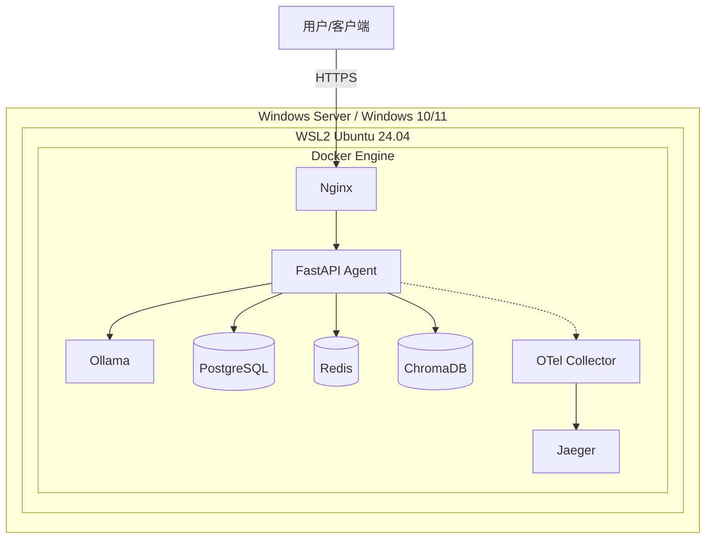

保存后，把文件丢给 Codex / Trae 即可。核心差异只有三点：**Docker 运行时（Linux Engine vs WSL2 Engine）、Ollama 访问方式（容器服务名 vs **`host.docker.internal`**）、卷挂载路径**。其余 Python 3.14、CPU 推理、免费开源工具链完全一致。

# AI-Agent-Windows-WSL2.md

# 本地化 AI Agent 生产环境开发文档（Windows / WSL2）

> 目标：完全免费、本地化、Docker 部署、生产级健壮的 AI Agent。\
> 平台：Windows Server 2022+ 或 Windows 10/11（通过 WSL2）\
> Python：3.14\
> 硬件：无 GPU，纯 CPU 推理\
> 用途：交付给 Codex / Trae 作为开发规范与实施指南。

***

## ⚠️ Windows 平台关键约束

### 1. Windows Server 不支持 Docker Desktop

生产环境正确方案：

| 方案                          | 场景    | 说明                                |
| :-------------------------- | :---- | :-------------------------------- |
| WSL2 + Docker Engine        | 生产推荐  | 在 WSL2 Ubuntu 中安装原生 Docker Engine |
| Hyper-V 虚拟机 + Docker Engine | 备选    | 完整 Linux VM，隔离好，开销略大              |
| Docker Desktop              | 开发/测试 | Windows 10/11，非生产                 |

本方案基于 **WSL2 + Docker Engine**。

### 2. 性能损耗

WSL2 虚拟化开销使 AI 推理比原生 Linux 低 10-20%。纯 CPU 下建议使用更小模型，如 `llama3.2:3b`、`qwen2.5:3b`。

### 3. Ollama 部署选择

| 方式                      | 优点         | 缺点                         |
| :---------------------- | :--------- | :------------------------- |
| Windows 宿主机原生 Ollama    | 安装简单       | 容器需 `host.docker.internal` |
| WSL2 中 Docker 运行 Ollama | 与 Linux 一致 | 需在 WSL2 安装                 |

推荐：在 WSL2 中通过 Docker Compose 运行 Ollama。

***

## 一、WSL2 前置配置

PowerShell（管理员）：

```powershell
wsl --install
wsl --set-default-version 2
wsl --install -d Ubuntu-24.04
```

进入 WSL2 后安装 Docker Engine：

```bash
sudo apt update
sudo apt install -y ca-certificates curl gnupg
sudo install -m 0755 -d /etc/apt/keyrings
curl -fsSL https://download.docker.com/linux/ubuntu/gpg | sudo gpg --dearmor -o /etc/apt/keyrings/docker.gpg
echo "deb [arch=$(dpkg --print-architecture) signed-by=/etc/apt/keyrings/docker.gpg] https://download.docker.com/linux/ubuntu $(. /etc/os-release && echo "$VERSION_CODENAME") stable" | sudo tee /etc/apt/sources.list.d/docker.list
sudo apt update
sudo apt install -y docker-ce docker-ce-cli containerd.io docker-compose-plugin
sudo usermod -aG docker $USER
```

> 关键：使用 WSL2 内 Docker Engine，而非 Docker Desktop。

***

## 二、工具清单与版本

与 Linux 版一致，主要差异：

| 工具             | Windows/WSL2 差异              |
| :------------- | :--------------------------- |
| Docker Engine  | 在 WSL2 Ubuntu 中安装            |
| Docker Compose | WSL2 内 docker-compose-plugin |
| Git            | WSL2 内 Linux 版 Git           |

其余版本同 Linux 版：Ollama 0.32.3、ChromaDB 1.5.9、PostgreSQL 16-alpine、Redis 7.2-alpine、Nginx alpine、OTel、Jaeger v2、Python 3.14、uv、FastAPI。

***

## 三、系统架构



> 所有容器运行在 WSL2 Linux 内核中，Docker Compose 与 Linux 版基本一致。

***

## 四、Docker Compose（Windows/WSL2）

与 Linux 版基本一致，差异如下。

### 4.1 卷挂载

推荐使用 Docker 命名卷，数据存储在 WSL2 ext4 中：

```yaml
volumes:
  ollama_data:
  chroma_data:
  pg_data:
  redis_data:
```

如需挂载 Windows 路径（不推荐生产）：

```yaml
volumes:
  chroma_data:
    driver: local
    driver_opts:
      type: none
      device: "C:/Users/agent/data/chroma"
      o: bind
```

### 4.2 Ollama 配置

如果在 WSL2 中运行 Ollama，配置与 Linux 版一致。

如果使用 Windows 宿主机原生 Ollama，移除 Compose 中的 `ollama` 服务，并将 `agent-api` 环境变量改为：

```yaml
environment:
  OLLAMA_HOST: http://host.docker.internal:11434
```

### 4.3 其余服务

ChromaDB、PostgreSQL、Redis、Nginx、OTel Collector、Jaeger 与 Linux 版相同。

完整 Compose 可直接复用 Linux 版，仅根据上述调整 Ollama 与卷。

***

## 五、Dockerfile

与 Linux 版完全相同，使用 `python:3.14-slim` 多阶段构建。

***

## 六、代码组织

与 Linux 版相同。

### Windows/WSL2 特有注意事项

| 事项   | 要求                                           |
| :--- | :------------------------------------------- |
| 文件路径 | 在 WSL2 内使用 `/home/user/project`，避免 `/mnt/c/` |
| 换行符  | Git `core.autocrlf=input` 或 `.gitattributes` |
| 文件监听 | 开发时使用轮询模式                                    |
| 端口转发 | WSL2 自动转发 localhost 到 Windows                |
| 防火墙  | 允许 WSL2 网络流量                                 |

### LLM 调用（CPU，Windows 推荐小模型）

```python
from langchain_ollama import ChatOllama

llm = ChatOllama(
    model="llama3.2:3b",
    base_url="http://ollama:11434",
    temperature=0.1,
    num_predict=1024,
    timeout=300,
)
```

***

## 七、生产环境规则

安全规则与 Linux 版一致。

### WSL2 额外稳定性要求

| 规则    | 要求                            |
| :---- | :---------------------------- |
| 内存限制  | 配置 `.wslconfig`               |
| 自动启动  | 任务计划程序确保 WSL2 随系统启动           |
| 数据持久化 | 使用 Docker 命名卷，避免 Windows 文件系统 |

`.wslconfig` 示例，放在 `C:\Users\<用户名>\.wslconfig`：

```ini
[wsl2]
memory=48GB
processors=16
swap=8GB
localhostForwarding=true
```

端口规则：仅绑定 `127.0.0.1`，WSL2 自动转发到 Windows。

***

## 八、验收标准

- WSL2 正常启动，Docker Engine 运行正常
- `docker compose up -d` 一键启动
- 所有服务健康检查通过
- Agent 可处理 HTTP 请求并返回 LLM 结果
- RAG 可基于本地文档回答
- Jaeger 可见完整追踪
- 单次 LLM 调用 < 120s（CPU，3B）
- Windows 宿主机可通过 `localhost:8080` 访问 API

***

## 九、Windows 排障

| 问题            | 原因                | 解决                        |
| :------------ | :---------------- | :------------------------ |
| 容器无法访问 Ollama | Ollama 在宿主机       | 使用 `host.docker.internal` |
| 卷挂载失败         | Windows 路径格式      | 用正斜杠或 WSL2 内部路径           |
| WSL2 内存溢出     | 未限制内存             | 配置 `.wslconfig`           |
| 文件监听不生效       | WSL2 文件事件         | 使用轮询                      |
| Docker 无响应    | Docker Desktop 干扰 | 使用 WSL2 内 Docker Engine   |
| Git 换行符       | CRLF/LF 混用        | `core.autocrlf=input`     |

